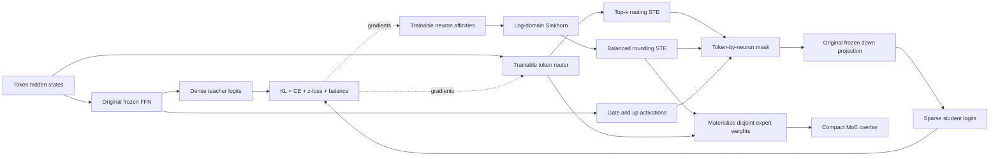

# DOT-MoE Converter

An independent PyTorch reproduction of
**[DOT-MoE: Differentiable Optimal Transport for MoEfication](https://arxiv.org/abs/2606.01666)**
(Bamba et al., ICML 2026), packaged as a dense-to-MoE converter for gated-SiLU
LLaMA/Qwen-style checkpoints.

This is an independent implementation, not the authors' official code.

## Why convert a dense model?

A dense transformer evaluates every feed-forward neuron for every token. A
Mixture-of-Experts model keeps the full parameter capacity, but routes each
token through only a subset of those neurons. DOT-MoE performs that conversion
without randomly splitting the FFN or permanently pruning weights. Instead, it
learns which neurons should form an expert at the same time as it learns which
tokens should use that expert.

The conversion has two outputs for each transformer layer:

- a balanced neuron-to-expert membership vector; and
- a token router that selects a fixed number of experts.

Together they allow the original dense FFN weights to be reorganized into
disjoint experts while preserving the complete source parameter set.

## Architecture



During alignment, the dense projections remain frozen. Straight-through
estimators use hard expert decisions in the forward pass while allowing the
soft Sinkhorn plan and router probabilities to receive gradients. After
alignment, Sinkhorn and the estimators are removed: inference uses only the
saved hard membership and router weights.

## What is reproduced

For every dense FFN, the converter:

1. creates a learnable neuron-to-expert affinity matrix;
2. computes an equal-capacity soft assignment with 50 log-domain Sinkhorn
   iterations;
3. greedily rounds it to a disjoint, exactly balanced partition;
4. uses straight-through estimators for that partition and top-k token routing;
5. freezes the source weights and jointly trains only assignments and routers;
6. optimizes the paper's KL + language-model CE + router z-loss + load-balance
   objective; and
7. slices the original gate/up/down projections into standard sparse experts.

The saved checkpoint is a compact overlay: expert membership plus router
weights. It never modifies or redistributes the source model weights.

### Balanced assignment

Each neuron supplies one unit of transport mass and every expert must receive
exactly `intermediate_size / expert_count` neurons. Log-domain Sinkhorn
normalization produces a differentiable soft transport plan with those row and
column marginals. Greedy rounding then converts the plan into an exactly
balanced binary assignment.

### Joint routing alignment

The token router and neuron assignment are trained together. The sparse
student is compared with the original dense model using output-distribution KL
divergence and language-model cross-entropy. Router z-loss limits unstable
logits, while the load-balancing term discourages expert collapse.

### Export

For expert `e`, the converter gathers the corresponding rows from `gate_proj`
and `up_proj`, and the matching columns from `down_proj`. The original model is
not overwritten; loading an overlay reconstructs these experts from the pinned
source checkpoint.

## Quick verification

```bash
git clone https://github.com/meloburr/dense-to-moe-converter.git
cd dense-to-moe-converter
python3 -m venv .venv
source .venv/bin/activate
pip install -r requirements.txt
python -m unittest test_ot_moe -v
```

The tests cover balanced transport marginals, gradient flow through both STEs,
frozen dense weights, dtype preservation, masked-to-materialized export
equivalence, and full-model logits when every expert is active.

## Convert a model

Two profiles are provided:

| Profile | Purpose | Default steps | Sequence length | Training data |
|---|---|---:|---:|---|
| `smoke` | Verify the complete pipeline on accessible hardware | 10 | 128 | WikiText-2 |
| `paper` | Match the reported alignment hyperparameters | 3,500 | 2,048 | Dolmino Mix |

The smoke profile validates the complete conversion pipeline with a small data
and step budget. It is not expected to reproduce the paper's scores:

```bash
./convert-dot-moe \
  --model Qwen/Qwen2.5-0.5B \
  --output outputs/qwen2.5-0.5b-dot-moe \
  --profile smoke \
  --device cpu \
  --dtype float32
```

Run the reported Qwen2.5-7B topology and alignment recipe with:

```bash
./convert-dot-moe \
  --model Qwen/Qwen2.5-7B \
  --output outputs/qwen2.5-7b-dot-moe \
  --profile paper \
  --device cuda \
  --dtype bfloat16
```

The paper profile derives 148 experts of 128 neurons and activates 37 per token
for Qwen2.5-7B. It uses 3,500 optimizer steps, sequence length 2,048, batch size
64, the reported loss weights, temperature annealing from 1.0 to 0.1, and the
streamed `allenai/dolmino-mix-1124` dataset. The paper reports this alignment as
taking under three hours for LLaMA-3-8B on 8 H100 GPUs; this reference runtime
is single-process and correctness-oriented, so comparable throughput requires
distributed training and fused expert kernels.

Use `--resume` after an interrupted run. A state checkpoint is written every 25
steps. `--offline-teacher` caches dense logits, which is faster but can consume
very large host memory; the default computes an exact online teacher by
temporarily activating all experts.

## Outputs

```text
outputs/qwen2.5-7b-dot-moe/
├── recipe.json
├── report.json
├── alignment_metrics.json
├── layer_00.safetensors
├── ...
└── layer_27.safetensors
```

| File | Contents |
|---|---|
| `recipe.json` | Source revision, topology, profile, dataset, and runtime settings |
| `alignment_metrics.json` | Per-layer expert counts and alignment diagnostics |
| `report.json` | Dense and converted evaluation results plus a generation sample |
| `layer_XX.safetensors` | Hard neuron membership and trained router for one layer |

The source checkpoint is intentionally not copied into the output directory.
This keeps overlays small and avoids redistributing third-party model weights.

Load, evaluate, or generate from an overlay with:

```bash
python qwen_moe.py evaluate --checkpoint outputs/qwen2.5-7b-dot-moe --device cuda
python qwen_moe.py generate \
  --checkpoint outputs/qwen2.5-7b-dot-moe \
  --device cuda \
  --prompt "Explain balanced optimal transport."
```

The custom Python dispatcher is a correctness implementation. The materialized
experts have the standard `[expert, intermediate, hidden]` structure needed for
a fused-MoE backend, but direct vLLM/llama.cpp/Ollama serialization is not yet
implemented.

## Paper-to-code map

| Paper component | Implementation |
|---|---|
| Eq. 7 / Algorithm 1, log-domain Sinkhorn | `ot_moe.py::sinkhorn` |
| Eq. 11, assignment STE | `AlignmentFFN.forward` |
| Eq. 12, top-k routing STE | `AlignmentFFN.forward` |
| Eq. 13, router z-loss | `AlignmentFFN.forward` |
| Eq. 14, load balancing | `AlignmentFFN.forward` |
| Eq. 15, total objective | `qwen_moe.py::global_dot_alignment` |
| Eq. 16, masked sparse computation | `AlignmentFFN.forward` |
| Expert materialization | `SparseGatedMoE` |
| Paper/scaled profiles | `dot_moe_converter.py` |

## Scope and limitations

- Supported FFNs must expose bias-free `gate_proj`, `up_proj`, and `down_proj`
  with SiLU activation and an intermediate width divisible by expert size.
- The published 1.2B-token continued fine-tuning stage is distinct from the
  3,500-step alignment and is not silently approximated here.
- Benchmark reproduction requires the paper's hardware budget and
  `lm-evaluation-harness` settings; a smoke run establishes implementation
  correctness, not the reported accuracy numbers.
- Model and dataset licenses remain their owners' licenses. This repository's
  source code is MIT licensed.

## Legacy experiment

`convert-better-moe` and `better_moe_converter.py` retain the earlier
quality-gated shared-backbone adapter experiment. That path runs the full dense
FFN and is intentionally separate from the paper-faithful, FLOP-reducing
`convert-dot-moe` command.
